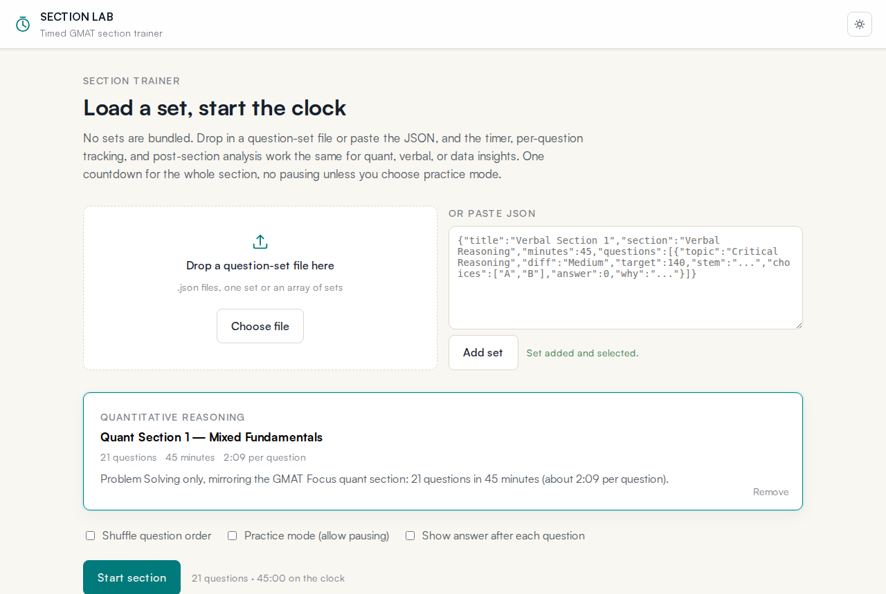
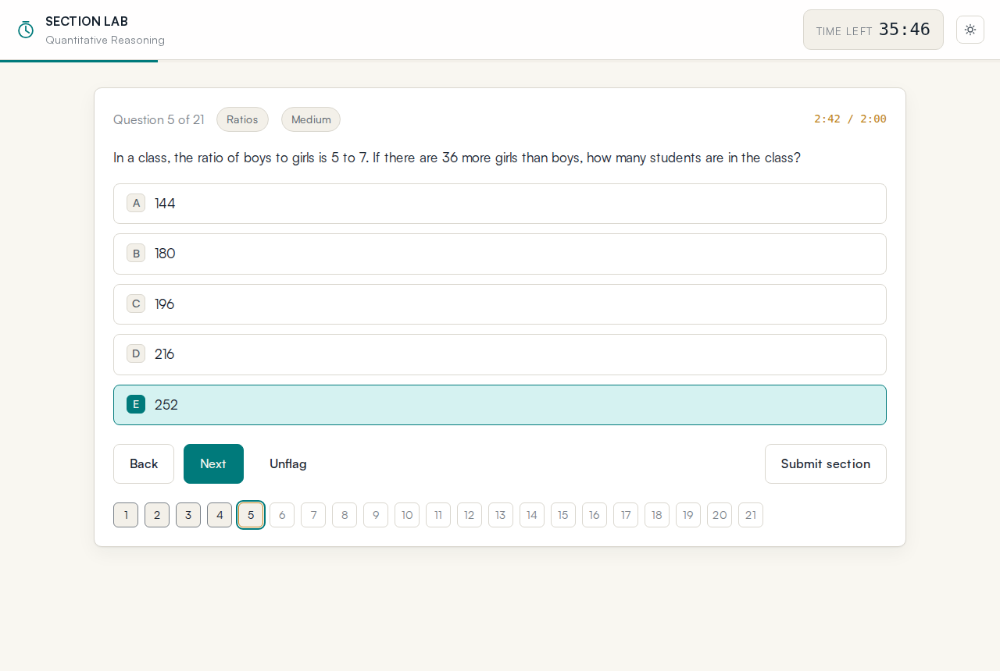
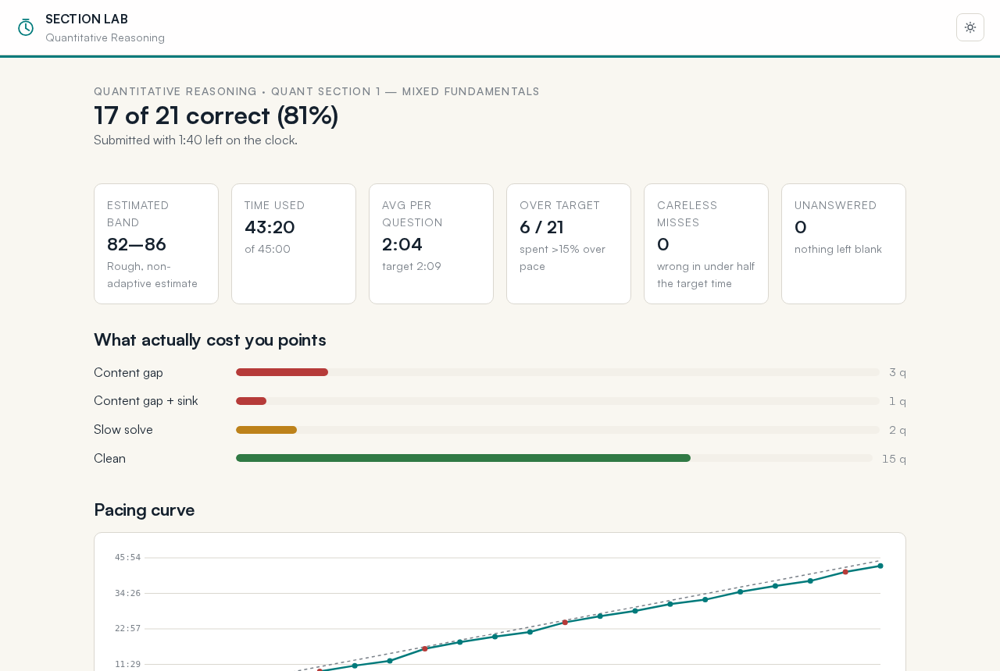
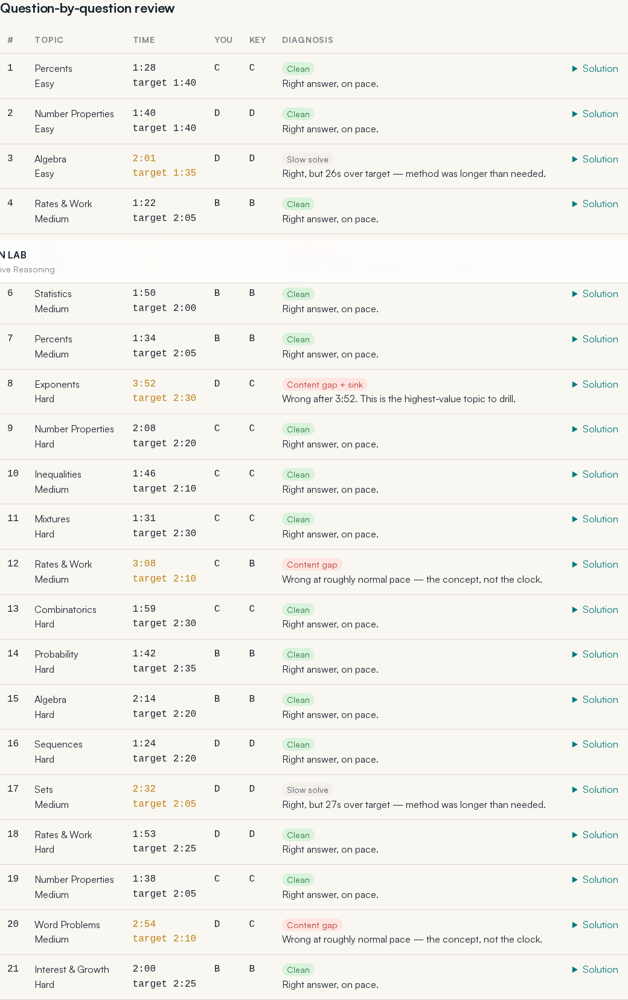

# Section Lab

A browser-based timed section trainer for GMAT-style practice. Load a question set, run the section against a single countdown clock, and get a post-section report that tells you where the points actually went: content gaps, careless misses, or pacing.

**[Try it live](https://bdas123.github.io/section-lab/)** — load a set from `example-sets/` and run a section.

No accounts, no server, no tracking. One HTML file, one stylesheet, one script, and a bundled copy of KaTeX for math. Everything runs locally in the browser.



## Why it exists

Most drilling tools give you a score. A score does not tell you whether you missed a question because you did not know the concept or because you burned 4:10 on question 6 and rushed the last three. Section Lab times every question individually against a target, then classifies each miss so a study session produces an actionable error log instead of a percentage.

## Screenshots

| Timed section | Post-section report |
| --- | --- |
|  |  |

The review table diagnoses every question, and the pacing curve shows cumulative time against an even-pace benchmark:



## Features

- **One section clock.** A single countdown for the whole section, like the real test. Warning state at 20% remaining, critical at 7%, auto-submit at zero.
- **Per-question time banking.** Time is attributed to whichever question is on screen, including revisits, so the accounting survives jumping around.
- **Question types.** Multiple choice, multi-select ("select all that apply"), and two-part analysis, with optional passage or data-table stimulus.
- **LaTeX rendering.** Math anywhere in a set — stems, choices, passages, table cells, explanations.
- **Flags, palette, keyboard shortcuts.** `A`–`E` to answer, arrows to move, `F` to flag.
- **Post-section report.** Accuracy, rough score band, pacing curve against an even-pace benchmark, accuracy by topic and difficulty, a per-question review table with diagnosis, and collapsible solutions.
- **Error log export.** Download the flagged questions as JSON, or copy a tab-separated block that pastes straight into a spreadsheet error log.
- **Practice mode.** Optional pausing, answer reveal after each question, and shuffled question order.
- **Dark mode.**

## Full walkthrough

[HOW-TO-USE.md](HOW-TO-USE.md) is a step-by-step guide covering loading sets, the modes, reading the report, exporting an error log, and writing your own sets.

## Quick start

Easiest path: open the [live demo](https://bdas123.github.io/section-lab/) and load one of the sample sets from `example-sets/`. To run it yourself:

```bash
git clone https://github.com/bdas123/section-lab.git
cd section-lab
open index.html          # macOS; on Linux use xdg-open, on Windows just double-click
```

Any static host works too — GitHub Pages, Netlify, an S3 bucket, or `python3 -m http.server` if you prefer a local server.

Then:

1. Click one of the **Load a sample** links (quant section, Data Insights, or LaTeX demo), or bring your own: drag a set file onto the dropzone, click **Choose file**, or paste JSON and press **Add set**. Nothing ships bundled — the app starts empty on purpose. The sample links fetch from `example-sets/`, so they need the app served over http; opening `index.html` directly still works with Choose file.
2. Pick the set card you want, choose any options (shuffle, practice mode, reveal answers), and press **Start section**.
3. Work the section. The clock does not stop unless practice mode is on.
4. Read the report, then download the JSON error log.

`example-sets/` contains three ready-to-load files: a 21-question quant section, a short Data Insights demo exercising every question type, and a LaTeX smoke test.

## Writing your own sets

A set is a single JSON object. See [SET-FORMAT.md](SET-FORMAT.md) for the full schema and the diagnosis rules.

```json
{
  "id": "quant-02",
  "title": "Quant Section 2 — Word Problems",
  "section": "Quantitative Reasoning",
  "minutes": 45,
  "note": "Shown on the set card.",
  "questions": [
    {
      "topic": "Rates & Work",
      "diff": "Medium",
      "target": 125,
      "stem": "A pump fills a tank in $6$ hours. Working together with a second pump, it fills the tank in $\\frac{18}{5}$ hours. How long would the second pump take alone?",
      "choices": ["$7$ hours", "$8$ hours", "$9$ hours", "$10$ hours", "$12$ hours"],
      "answer": 2,
      "why": "Combined rate $\\frac{5}{18}$ minus $\\frac{1}{6}$ leaves $\\frac{1}{9}$, so 9 hours."
    }
  ]
}
```

`topic`, `diff`, and `target` are what drive the analysis, so fill them in. A `.json` file may hold one set object or an array of sets, and multiple files can be loaded at once. Malformed sets are rejected on load with the specific reason, so a broken set never starts a timed section.

LaTeX uses `$ ... $` or `\( ... \)` inline and `$$ ... $$` or `\[ ... \]` for display blocks. Remember that JSON requires doubled backslashes: `"$\\frac{3}{4}$"`.

## Diagnosis taxonomy

Each question is classified from correctness and time against its target:

| Label | Rule |
| --- | --- |
| Clean | Correct, at or under 115% of target |
| Slow solve | Correct, 115–150% of target |
| Time sink | Correct, over 150% of target |
| Careless | Wrong in under 50% of target |
| Content gap | Wrong at roughly normal pace |
| Content gap + sink | Wrong and over 150% of target |
| Unanswered | No answer recorded |

The score band in the report is a rough, non-adaptive approximation from raw accuracy. It is useful for tracking your own trend, not for predicting an official score.

## Project layout

```
index.html        markup and the three screens: setup, exam, report
app.js            engine: timer, question rendering, scoring, report, export
styles.css        design tokens, light/dark themes, layout
SET-FORMAT.md     question set schema
example-sets/     loadable sample sets
vendor/katex/     bundled KaTeX (MIT) for offline math rendering
```

## Privacy

Sets you load stay in the browser tab. Nothing is uploaded, and there is no analytics or network call of any kind after the page loads. Closing the tab discards everything, so download the error log before you leave.

## License

MIT for the app code. KaTeX in `vendor/` is MIT licensed by its authors. The sample question sets are original practice items, not official GMAT material. GMAT is a registered trademark of the Graduate Management Admission Council, which does not endorse this project.
